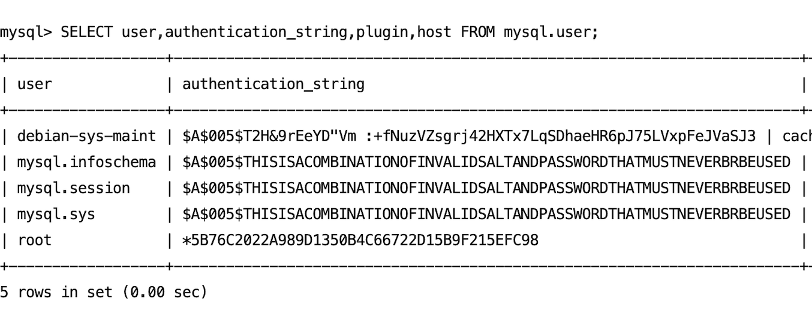

## 安装
这个比较简单。
```bash
sudo apt update
sudo apt install mysql-server
```
然后启动

```bash
#启动MySQL服务：
sudo systemctl start mysql.service
#使MySQL服务在系统启动时自动启动：
sudo systemctl enable mysql.service
```

检查MySQL服务的状态：
```bash 
sudo systemctl status mysql.service
```
登录到MySQL
```bash
sudo mysql -u root -p
```
## 设置密码
安装后发现，可以无密码登陆，后面需要远程连接，设置密码是必须的。
```sql
ALTER USER 'root'@'localhost' IDENTIFIED WITH mysql_native_password BY "你的密码';
```

刷新权限
```sql
flush privileges;
```

查看是否有密码：
```sql
SELECT user, authentication_string, plugin, host FROM mysql.user;
```
发现root用户`authentication_string`字段是有内容的了


## 增加远程访问

修改mysql库下的user表里的host字段
```sql
update user set host = '%' where user = 'root';
```
检查host字段是否修改掉：
```sql
select host, user from user;
```
刷新权限
```sql
FLUSH PRIVILEGES;
```
发现依然无法连接（端口已经开放了）

修改mysqld.cnf文件：
```bash
sudo vim /etc/mysql/mysql.conf.d/mysqld.cnf

```
将里面的`bind-address`修改为`0.0.0.0`。


重启数据库`sudo systemctl restart mysql.service`搞定了。