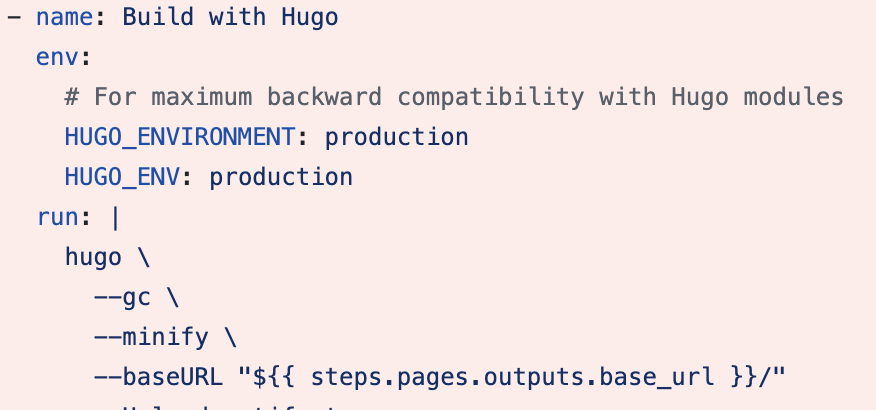
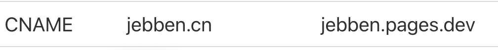

## 排查与定位
配置SEO robots的地方是 `_default/baseof.html`里：
```html 
  {{ $production := eq (getenv "HUGO_ENV") "production" | or (eq site.Params.env "production") }}
  {{ $public := not .Params.private }}

  {{ if and $production $public }}
  <meta name="robots" content="index, follow">
  {{ else }}
  <meta name="robots" content="noindex, nofollow">
  {{ end }}
```
上面的代码会先检查`HUGO_ENV`环境变量是否为`production`，并且网页是否设置了`private`私有,当环境变量为`production`并且不是私有页面会允许搜索引擎抓取：
```html
<meta name="robots" content="index, follow">
```
否则不允许。

经过排查，在自定义的工作流：`.github/workflows/flow.yml`里已经设置了环境变量：




百思不得其解。最后在github `Actions`里发现了端倪,原来我在cloudflare里启用了pages功能并配置了DNS记录：


这样，后续访问的是cloudflare pages版本而不是github pages版本了，由于疏忽，启用时忘记设置环境变量了。
## 解决方案

即然有两个pages，只需要保留一个即可，经过对比发现cloudflare pages更加的简单好用，无需配置自定义的workflow，并且每次提交github上也能看到cloudflare的build进程，然后我的域名也在cloudflare下。


于是打算放弃github pages：
- 删除github pages
- 删除github workflow
  
然后推送一个空提交，触发CI&CD,完美解决。


