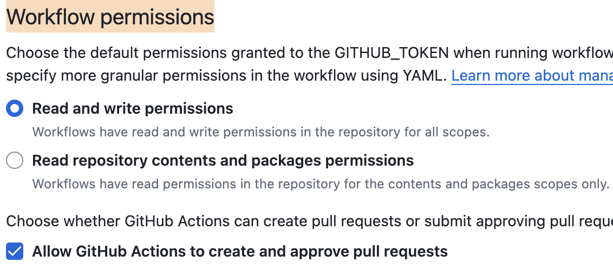

最近基于Hugo框架做了静态个人网站，使用github pages，搭配cloudflare免费版计划提供的一键CDN加速。一天之内完成了设计+开发+部署。也遇到了一些小问题，在此记录一下问题的具体情况以及解决的方法。

## Hugo端的配置
相关文档已经很细致，安装和其他的一些细节不在此赘述。

- 首先，基于`ananke`主题进行了小范围的修改，我的做法是将theme作为git的子模块（submodule），然后将theme目录下的布局目录（layout）复制到根目录下，然后在这里进行布局的修改，避免直接修改主题的源代码（因为直接修改主题的源代码会带来变动，在git树下会看到额外仓库的改动非常不舒服）。

- 其次添加一些自定义的css和字体，用到了预处理语言`sass`(写起来会更舒服一点)，如何编译、处理（合并）`sass`文件并引入到博客里。

引入样式：
```html
<!-- 这里的意思是 读取 /assets目录下的 子目录/css下的所有scss文件编译合并为custom.css，然后压缩印上指纹 -->
{{ $style := resources.Match "css/**.scss" | resources.Concat "custom.css" | toCSS | minify | fingerprint }}
<link rel="stylesheet" href="{{ $style.Permalink }}" integrity="{{ $style.Data.Integrity }}" media="screen">
```
使用自定义字体:
```html
  <style>
    @font-face {
      font-family: "GoodHood";
      src: url("/font/GoodHood.otf");
    }
  </style>
```
如果需要引入`js`文件参考上述处理css文件的做法。

## Github端的配置
首先增加一个workflow：`/.github/workflows/flow.yml`:
```yml
# Sample workflow for building and deploying a Hugo site to GitHub Pages
name: Deploy Hugo site to Pages
on:
  push:
    branches:
      - main
  workflow_dispatch:
permissions:
  contents: read
  pages: write
  id-token: write
concurrency:
  group: "pages"
  cancel-in-progress: false

defaults:
  run:
    shell: bash

jobs:
  # Build job
  build:
    runs-on: ubuntu-latest
    env:
      HUGO_VERSION: 0.115.1
    steps:
      - name: Install Hugo CLI
        run: |
          wget -O ${{ runner.temp }}/hugo.deb https://github.com/gohugoio/hugo/releases/download/v${HUGO_VERSION}/hugo_extended_${HUGO_VERSION}_linux-amd64.deb \
          && sudo dpkg -i ${{ runner.temp }}/hugo.deb          
      - name: Install Dart Sass
        run: sudo snap install dart-sass
      - name: Checkout
        uses: actions/checkout@v3
        with:
          submodules: recursive
          fetch-depth: 0
      - name: Setup Pages
        id: pages
        uses: actions/configure-pages@v3
      - name: Install Node.js dependencies
        run: "[[ -f package-lock.json || -f npm-shrinkwrap.json ]] && npm ci || true"
      - name: Build with Hugo
        env:
          # For maximum backward compatibility with Hugo modules
          HUGO_ENVIRONMENT: production
          HUGO_ENV: production
        run: |
          hugo \
            --gc \
            --minify \
            --baseURL "${{ steps.pages.outputs.base_url }}/"          
      - name: Upload artifact
        uses: actions/upload-pages-artifact@v1
        with:
          path: ./public
  # Deployment job
  deploy:
    environment:
      name: github-pages
      url: ${{ steps.deployment.outputs.page_url }}
    runs-on: ubuntu-latest
    needs: build
    steps:
      - name: Deploy to GitHub Pages
        id: deployment
        uses: actions/deploy-pages@v2
```
这样每次提交代码就能看到后续跟着一个action在执行了。

其次需要修改`Workflow permissions`,在路径`settings/Actions/General`下，设置为
这个配置：



然后等待构建完成，打开`https://{username}.github.io/{registryname}/`即可访问博客了。

## 配置自定义域名

我这里选择增加两个DNS记录：A记录和CNAME记录。比如我要设置的域名是：jebben.cn;我的github用户名是anderlaw。

- A:@:185.199.111.153(githubIP)
- CNAME:www.jebben.cn:anderlaw.github.io


增加完毕后，一般至少需要等待几个小时，所以弄完明天再来看看github page页面上的域名检查是否正常，通过了就表示设置成功了。

